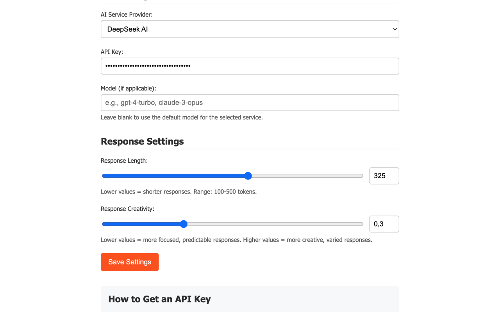
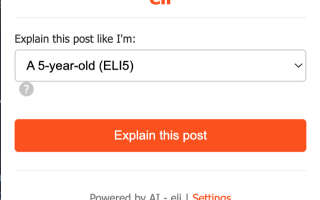

# eli Chrome Extension

A Chrome extension that uses AI to explain Reddit posts in a way that's easy to understand, with customizable explanation levels for different audiences.

## Screenshots

## Features

- **Multiple Explanation Levels**: Choose from various explanation styles (ELI5, non-technical, beginner, advanced, etc.) or create a custom explanation style.
- **Multiple AI Providers**: Support for:
  - OpenAI (GPT-3.5/GPT-4)
  - Anthropic (Claude)
  - DeepSeek AI
  - Google (Gemini)
  - Custom API endpoints (including support for Groq and Mistral AI)
- **Customization Options**:
  - Adjust response length to get shorter or more detailed explanations (default: 325 tokens)
  - Control response creativity/focus with temperature settings
  - Specify custom models for each AI provider
- **Seamless Integration**: Works directly on Reddit post pages with a convenient popup interface.
- **Privacy Focused**: Your API keys are stored locally and never shared with third parties.

## Installation

### From Chrome Web Store
[Install eli from the Chrome Web Store](https://chromewebstore.google.com/detail/eli/lpfkgenedglhflneakmjfnhjninginfl)

### Manual Installation
1. Download or clone this repository
2. Open Chrome and navigate to `chrome://extensions/`
3. Enable "Developer mode" in the top right corner
4. Click "Load unpacked" and select the folder containing the extension files
5. The Reddit Explainer icon should now appear in your Chrome toolbar

## Usage

1. Navigate to any Reddit post
2. Click the Reddit Explainer icon in your Chrome toolbar
3. Select an explanation level (or create a custom one)
4. Click "Explain this post"
5. View the AI-generated explanation

## Configuration

### API Keys
To use the extension with real AI explanations:
1. Click "Settings" in the popup or extension options
2. Select your preferred AI provider
3. Enter your API key
4. (Optional) Configure additional settings like model, response length, etc.
5. Click "Save Settings"
6. Click "Test Connection" to verify your API credentials work properly

### API Providers
- **OpenAI**: Get API keys from [OpenAI Platform](https://platform.openai.com/signup)
- **Anthropic**: Get API access from [Anthropic](https://www.anthropic.com/product)
- **DeepSeek**: Get API access from [DeepSeek Platform](https://platform.deepseek.com/)
- **Google**: Get API access from [Google AI Studio](https://ai.google.dev/)
- **Custom Endpoints**: Supports various API formats, including Groq and Mistral AI

### Custom API Endpoints
The extension now has improved support for the following custom API providers:
- **Groq**: Use https://api.groq.com/openai/v1/chat/completions
- **Mistral AI**: Use https://api.mistral.ai/v1/chat/completions

## Response Settings

- **Response Length**: Controls the maximum number of tokens in the AI's response. Lower values produce shorter, more concise explanations.
- **Response Creativity**: Controls the temperature parameter for the AI:
  - Lower values (0.1-0.3): More focused, predictable responses
  - Higher values (0.7-1.0): More creative, varied responses

## Privacy

We take your privacy seriously. This extension:
- Stores your API keys and preferences locally on your device
- Only sends data to the AI service you select, using your own API key
- Never collects or stores your data on our servers

For more details, see our [Privacy Policy](PRIVACY-POLICY.md).

## Development

### Project Structure
- `manifest.json`: Extension configuration
- `popup.html`/`popup.js`/`popup.css`: UI for the extension popup
- `content.js`: Content script for extracting Reddit post data
- `background.js`: Background script for managing content script injection
- `ai-service.js`: Handles AI API interactions
- `options.html`/`options.js`: Settings page

### Contributing
Contributions are welcome! Please feel free to submit a Pull Request.

## License

This project is licensed under a proprietary license that restricts commercial use, distribution, and modification. See the [LICENSE](LICENSE) file for details.

## Acknowledgments

- This extension uses various AI APIs to generate explanations
- Icon and design elements created for Reddit Explainer 